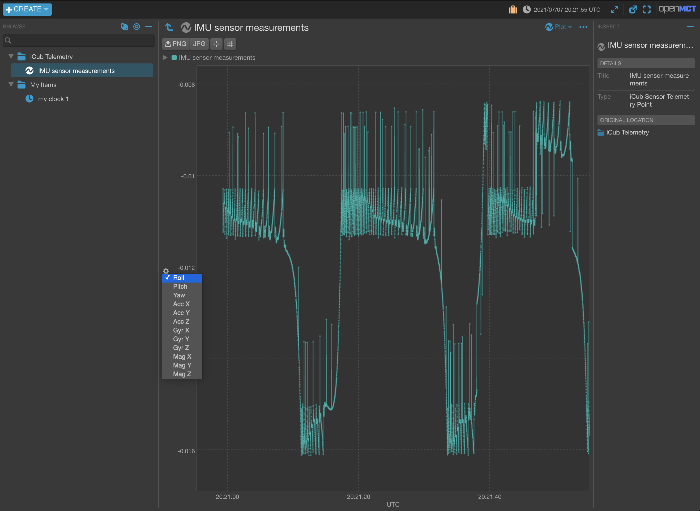
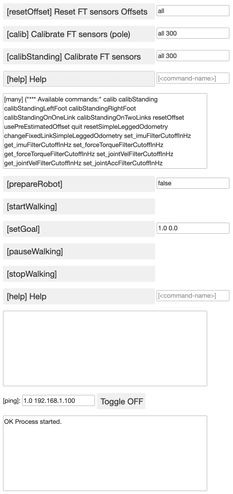

# Yarp - Open MCT

<b id="top"></b>
An Open MCT and Yarp based iCub telemetry visualizer.

## [Introduction](#top)

The **Yarp-OpenMCT** tool is meant for visualizing and plotting telemetry data from iCub sensors, published over a Yarp network. It collects sensor data published on a predefined set of Yarp output ports opened by the Yarp Robot Interface and exposes that data on predefined telemetry nodes within the visualizer interface as vectors or scalar signals. The pipeline can be summarized as follows:
- A telemetry data server reads the data from a Yarp port, then available within the server as realtime data.
- The data is buffered in a FIFO queue of predefined depth, and in parallel streamed over a [Socket.IO](https://socket.io/docs/v4) connection to the registered visualizer client<sup id="a1">[1](#f1)</sup>.
- The data is accessible via the respective telemetry node in the visualizer interface, in the left-hand tree under the "+Create" button. Any object visible in that tree is referred to as a "Domain Object" in the Open MCT glossary.

All telemetry nodes exposing sensor measurements shall appear under the folder "iCub Telemetry". They can then be combined in workspace layouts at the user convenience.

The visualizer implementation is based on the [Open MCT](https://github.com/nasa/openmct) (Open Mission Control Technologies), open source, next-generation mission control framework for the visualization of data on desktop and mobile devices. It is developed at NASA's Ames Research Center, and is being used by NASA for data analysis of spacecraft missions, as well as planning and operation of experimental rover systems.

In addition, the **Yarp-OpenMCT** tool provides a Control Console implementing a web interface to two RPC Yarp server devices:
- The **wholeBodyDynamics** RPC server (`/wholeBodyDynamics/rpc` port) through which you can run the FT sensors calibrator,
- The **WalkingModule** RPC server, through which you can run all walking coordinator actions, like setting the robot initial configuration, setting the destination position, turn, start and stop walking.

The Control Console GUI displays a series of buttons which trigger the same commands usually sent through the RPC interface running on a terminal.
These commands are implemented with the most common options, which can be set through editable text input forms.

## [Dependencies](#top)

### Server dependencies
- [NVM](https://github.com/nvm-sh/nvm): Node Version Manager.
- [Node.js](https://nodejs.org/en/): Asynchronous event-driven JavaScript runtime, designed to build scalable network applications.
- [npm](https://www.npmjs.com/): Node package manager.
- [Open MCT](https://github.com/nasa/openmct): Open source visualization framework by NASA.
- [YarpJS](https://github.com/robotology/yarp.js): Yarp Javascript bindings
- [YARP](https://github.com/robotology/yarp): Middleware for handling the communication with the robot.
- [CMake](http://www.cmake.org/download/)
- A proper C/C++ compiler toolchain for the given platform
    - Windows:
        - [Visual C++ Build Tools](https://visualstudio.microsoft.com/visual-cpp-build-tools/) or a recent version of Visual C++ (e.g. [the free Community](https://www.visualstudio.com/products/visual-studio-community-vs))
    - Unix/Posix:
        - Clang or GCC

#### Notes
- Additional dependencies [Open MCT](https://github.com/nasa/openmct) (Open source visualization framework by NASA) and [YarpJS](https://github.com/robotology/yarp.js) (Yarp Javascript bindings) are automatially installed by the Node.js `npm` package manager when installing the repository main modules (steps 7 and 8).
- [YARP](https://github.com/robotology/yarp), [CMake](http://www.cmake.org/download/) and C/C++ compiler toolchain are transitory dependencies which shouldn't be mentioned a priori here, but since they are not handled by the [YarpJS](https://github.com/robotology/yarp.js) installation process (via the package manager `npm`), they need to be manually installed.

### Client dependencies
- Browser: [Google Chrome](https://www.google.com/chrome), [Mozilla Firefox](https://www.mozilla.org/en-US/firefox/products), Apple Safari, etc.

### Optional Testing Dependencies
- [Gazebo](https://gazebosim.org): for simulating the iCub model dynamics with ground contacts (tested Gazebo 11).
- [icub-models](https://github.com/robotology/icub-models): provide the iCub models.
- [GazeboYARPPlugins](https://github.com/robotology/gazebo-yarp-plugins.git): Plugins interfacing the iCub simulation model with YARP device wrappers.
- [whole-body-estimators](https://github.com/robotology/whole-body-estimators): for estimating the ground contact wrenches and testing the force-torque sensors calibration interface with the control console.
- [walking-controllers](https://github.com/robotology/walking-controllers): suite of modules for achieving bipedal locomotion of the humanoid robot iCub.

### Note on Connecting to a Local Robot Network

The scope of this installation guide addresses only the modules required for running the **Yarp-OpenMCT** tool. You won't need additional modules if you are connecting your machine to a local robot network up and running.

As a reference, the bring up of such setup (out of scope of this installation guide) requires installing the [robotology-superbuild](https://github.com/robotology/robotology-superbuild) and enabling specific profiles...
- [ROBOTOLOGY_ENABLE_CORE](https://github.com/robotology/robotology-superbuild/blob/master/doc/cmake-options.md#core), for `yarprobotinterface`, YARP and its devices,
- [ROBOTOLOGY_ENABLE_ICUB_HEAD](https://github.com/robotology/robotology-superbuild/blob/master/doc/cmake-options.md#icub-head), for the iCub firmware drivers and additional YARP devices,
- [ROBOTOLOGY_ENABLE_DYNAMICS](https://github.com/robotology/robotology-superbuild/blob/master/doc/cmake-options.md#dynamics), for the `whole-body-estimators` and `walking-controllers`.


## [Server Installation](#top)

### Supported Platforms

The following instructions assume you are installing the software as a non-root user. Make sure that you have [Git](https://git-scm.com) installed in your platform. The tool installation and execution have been tested on **MacOS Catalina 10.15.7** and **Vanilla Ubuntu 20.04**.

:warning: The tool installation has not been tested on Windows. On top of that, the installation of dependencies **YARP, CMake** and **C/C++ compiler toolchain** binaries rely on the use of the `conda` package manager, which is still not fully supported on Windows PowerShell (https://github.com/robotology/robotology-superbuild/issues/890), and was not tested on [Git Bash](https://gitforwindows.org/) nor Windows Subsystem for Linux ([WSL](https://docs.microsoft.com/en-us/windows/wsl/install),[Ubuntu on WSL](https://ubuntu.com/wsl)).

### Install NVM, Node.js and npm

⚠️ Run the installation steps 1 and 2 from a new terminal without any `conda` package manager environment enabled.

1. If you're not already using [**NVM**](https://github.com/nvm-sh/nvm), a **Node.js** Version Manager by MIT, install it. **NVM** safely handles the installation of multiple versions of Node.js and easy switching between them. As mentioned in later steps, two different versions of Node.js versions are required for installing and running the visualization tool.
    Follow the NVM installation instruction steps in https://github.com/nvm-sh/nvm, recapped below. NVM **v0.38.0** is the latest version used in the visualization tool installation procedure described in the subsequent sections.
    
    a. Run the command below which downloads and runs the one-line installer
    ```
    curl -o- https://raw.githubusercontent.com/nvm-sh/nvm/v0.38.0/install.sh | bash
    ```
    b. After restarting the terminal, the following lines were added to the `~/.bashrc` (`~/.bash_profile` on MacOS)
    ```
    export NVM_DIR="$HOME/.nvm"
    [ -s "$NVM_DIR/nvm.sh" ] && \. "$NVM_DIR/nvm.sh"  # This loads nvm
    [ -s "$NVM_DIR/bash_completion" ] && \. "$NVM_DIR/bash_completion"  # This loads nvm bash_completion
    ```
    c. List available Node.js releases
    ```
    nvm ls-remote
    ```

2. Install **Node.js** and **npm** from the same terminal. Currently, the latest **Node.js** LTS version compatible with **YarpJS** `master` commit [be28630](https://github.com/robotology/yarp.js/commit/be2863022713ded2fa48909404b43e98b09eeda2) is the LTS: Argon release **Node.js v4.2.2** (refer to https://github.com/robotology/yarp.js/issues/19). Meanwhile, the latest **Node.js** LTS version compatible with **Open MCT** is latest LTS:Fermium version **Node.js v14.17.0**. For this reason we install both releases.
    ```
    nvm install 4.2.2 --latest-npm          // installs the LTS:Argon version v4.2.2 and latest respective supported npm (v2.14.7)
    nvm install 14.17.0 --latest-npm        // installs latest LTS:Fermium version v14.17.0 and latest respective supported npm (v6.14.13)
    nvm alias default v4.2.2                // updates the default alias
    nvm ls                                  // lists available and active nodejs and npm versions
    ```

### Install YARP, CMake and the C++ Compilers

⚠️ It is recommended to install the **YARP, CMake** and **C/C++ compiler toolchain** binaries using the [Conda package manager](https://anaconda.org/) and installing the respective packages from the [Robotology Conda channel](https://anaconda.org/robotology), as described in the following steps.

3. If you are not already using the `conda` package manager, install the `conda` mambaforge distribution following https://github.com/robotology/robotology-superbuild/blob/master/doc/install-mambaforge.md#linux. Remember to restart your shell session or run `source ~/.bashrc` (`~/.bash_profile` on MacOS) for the `conda init` command to take effect.
    - Create a new environment and activate it:
        ```
        conda create -n icubtelemenv
        conda activate icubtelemenv
        ```
    To read more about installing robotology package binaries refer to https://github.com/robotology/robotology-superbuild/blob/master/doc/conda-forge.md#binary-installation.
    
    All the following steps shall be run within the activated `conda` **icubtelemenv** environment. It is critical that you haven't any Node.js package installed through `conda` (**nodejs**) in that same environment since you will be using the Node.js package from NVM.

4. Install **YARP** from the [Robotology Conda channel](https://anaconda.org/robotology)
    ```
    mamba install -c robotology yarp
    ```
    To read more about installing `robotology` package binaries refer to https://github.com/robotology/robotology-superbuild/blob/master/doc/conda-forge.md#binary-installation.

5. Install the `compilers` and `cmake` packages from the [Robotology Conda channel](https://anaconda.org/robotology) (in case a specific CMake version meeting specific **YarpJS** requirements is maintained in that channel. Otherwise, `mamba` falls back to its default channel)
    ```
    mamba install -c robotology compilers cmake
    ```

### Install the Repository

6. Clone the `yarp-openmct` repository into `<yarp-openmct-root-folder>` folder
    ```
    git clone https://github.com/dic-iit/yarp-openmct.git <yarp-openmct-root-folder>
    ```

7. Install the **iCubTelemVizServer** server: go to the `<yarp-openmct-root-folder>/iCubTelemVizServer` folder, select **node v4.2.2** and install the server
    ```
    cd yarp-openmct/iCubTelemVizServer
    nvm use 4.2.2
    npm install
    ```

8. Install the **Open MCT** based visualizer: go to `<yarp-openmct-root-folder>/openmctStaticServer`, select **node v14.17.0** and install the server
    ```
    cd yarp-openmct/openmctStaticServer
    nvm use 14.17.0
    npm install
    ```

### Additional Modules for Testing on Gazebo

For testing the visualization tool along with its control console, you can run a simulation on Gazebo with `iCubGazeboV2_5` or `icubGazeboSim` model. For that you need first to install the modules listed in Section #simulation-dependencies, as follows:
1. Install **Gazebo** through your platform package manager or following https://gazebosim.org/tutorials?cat=install.
1. We recommend to install the remaining modules (icub-models, GazeboYARPPlugins, whole-body-estimators, walking-controllers) binaries from the [Robotology Conda channel](https://anaconda.org/robotology) under the environment `icubtelemenv` used in previous steps.
1. Install the icub-models, GazeboYARPPlugins, whole-body-estimators and walking-controllers modules
    ```
    mamba install -c conda-forge -c robotology gazebo-yarp-plugins icub-models whole-body-estimators walking-controllers
    ```

If you wish to check the battery state visualization handling on the telemetry visualization tool, you need to install the fake battery device which publishes a fake battery state (voltage, current, temperature, charge level, ...) on the `/icubSim/battery/data:o` port.

4. Go to the repository `yarp-openmct` root folder.
4. create a build folder `build`, run CMake, and run `ccmake` for editiong the CMake variables
   ```
   mkdir buid
   cd build
   cmake ..
   ccmake .
   ```
4. Set the `CMAKE_INSTALL_PREFIX` to your `$ROBOTOLOGY_SUPERBUILD_INSTALL_PREFIX` if you're using the superbuild, or any other location at your convenience.
4. Set the `ICUB_MODELS_TO_INSTALL`, which is by default set to `iCubGazeboV2_5`.
4. Turn `INSTALL_FAKE_BATTERY_DEVICE_CONFIG_FILES` on. Actually, the CMake configuration in the repository is for installing any device of additional module to build through the CMake system. In such case, installing the fake battery device can still be optional.
4. configure and generate the CMake files (hit "c" as many times as required, then "g").
4. install
   ```
   make install
   ``` 

### Notes
- For checking the active Node.js/npm versions, run respectively `node -v` and `npm -v`.
- The installation of Open MCT dependency completes with a warning on some detected network vulnerability (refer to https://github.com/ami-iit/yarp-openmct/issues/35). This is not critical as we are running everything in a local private network, but further analysis is required.


## [Client Installation](#top)

Install one of the browsers listed in the client dependencies.


## [How to Run the Telemetry Visualization Tool](#top)

### Prior Testing the Visualization Tool on Gazebo

If you wish to test the features of the installed tool, and installed #additional-modules-for-testing on Gazebo, run the simulation as follows:

1. Activate the `icubtelemenv` environment
   ```
   conda activate icubtelemenv
   ```
1. Set the YARP_ROBOT_NAME environment variable according to the chosen Gazebo model (`icubGazeboSim` or `iCubGazeboV2_5`):
   ```
   export YARP_ROBOT_NAME="iCubGazeboV2_5"
   ```
1. Run the YARP server
   ```
   yarpserver --write
   ```
1. Run Gazebo and drag and drop the iCub model (`icubGazeboSim` or `iCubGazeboV2_5`):
   ```
   gazebo -slibgazebo_yarp_clock.so
   ```
1. For calibrating the FT sensors from the Control Console client and/or visualize the ground reaction forces plots, run the **wholeBodyDynamics** RPC server:
   ```
   YARP_CLOCK=/clock yarprobotinterface --config launch-wholebodydynamics.xml
   ```
   - **FT sensors calibration:** make sure the RPC port `/wholeBodyDynamics/rpc` is available.
   - **Ground Reaction Forces:** make sure the RPC ports `/wholeBodyDynamics/left_foot/cartesianEndEffectorWrench:o` and `/wholeBodyDynamics/right_foot/cartesianEndEffectorWrench:o` are available.
1. For using the Walking Coordinator from the Control Console client, run the `WalkingModule` RPC server and make sure it opens the RPC port `/walking-coordinator/rpc`.
   ```
   YARP_CLOCK=/clock WalkingModule
   ```
1. **iCub Cameras:** Run two `fakeFrameGrabber` and `grabberDual`<sup>[1](#f1)</sup> devices, streaming image data on the respective ports `/icubSim/camera/left` and `/icub/camera/right`.
   ```
   YARP_CLOCK=/clock yarpdev --device fakeFrameGrabber --name /icubSim/camera/left
   YARP_CLOCK=/clock yarpdev --device fakeFrameGrabber --name /icubSim/camera/right
   ```
1. **Battery State:** Run the `fakeBattery` and `batteryWrapper`<sup>[2](#f2)</sup> device and make sure it opens the port `/icubSim/battery/data:o`:
   ```
   YARP_CLOCK=/clock yarprobotinterface --config battery/icub_battery.xml
   ```

<br></br>
<b id="f1">(1)</b> http://www.yarp.it/git-master/note_devices.html#note_devices_example, http://www.yarp.it/git-master/yarpview.html, http://www.yarp.it/git-master/yarpdev.html, **grabberDual** device parameters described in the [grabberDual device page](http://www.yarp.it/git-master/classServerGrabber.html#grabberDual_device_parameters).

<b id="f2">(2)</b> **batteryWrapper** device parameters described in the [Device implementation](http://www.yarp.it/git-master/group__dev__impl.html) -> Network Wrapper -> batteryWrapper device page.
<br></br>

### Visualizing Real Robot Telemetry Data: connect to a Running Robot Network

If you wish to visualize iCub telemetry data from a robot setup already running on its local network under a given namespace \<yarpRobotNamespace\> (e.g. `/icub`, `/myNameSpace`), follow the steps below:

(We assume that a `yarprobotinterface` is running on the robot iCub head, and a Yarp Name Server is running on the robot network)

1. Set the YARP_ROBOT_NAME environment variable according to the target model \<robotModel\> (e.g. `iCubGenova04`, `iCubGenova09`, ...):
   ```
   export YARP_ROBOT_NAME="<robotModel>"
   ```
2. Set the Yarp namespace, detect the Yarp name server and save its address:
   ```
   yarp namespace <yarpRobotNamespace>
   yarp detect --write
   ```

Depending on which robot data you wish to visualize or operation you wish to run from the Control Console, the respective applications should be running and the respective output YARP ports should be available in the robot network.
<details>
<summary>[Control console Functions / Telemetry Data] mapping to YARP devices/ports</summary>

| Function/Data | Data or RPC Port | Application |
| --- | --- | --- |
| IMU measurements | `inertial/icub/inertial` | `yarprobotinterface` |
| Joint positions | `/icub/<part>/stateExt:o`<sup>[3)](#f3)</sup> | `yarprobotinterface`| 
| Head cameras | `/icub/camera/left` </br> `/icub/camera/right` | `yarprobotinterface` |
| FT sensors calibration | `/wholeBodyDynamics/rpc` | `yarprobotinterface`|
| Ground reaction forces on the feet | `/wholeBodyDynamics/left_foot/cartesianEndEffectorWrench:o` </br> `/wholeBodyDynamics/right_foot/cartesianEndEffectorWrench:o` | `yarprobotinterface`|
| Battery status | `/icub/battery/data:o` | `yarprobotinterface` |
| Walking coordinator | `/walking-coordinator/rpc` | `WalkingModule` |

<b id="f3">(3)</b> `<part>` can be `left_leg`, `right_leg`, `torso`, etc.

</details>


### Run the Telemetry Server

#### Configure

1. Open a terminal on the same or any other machine connected to the network.

2. If you have used `conda` package manager to install the dependencies as described in Section #server-installation, activate the `conda` environment where you installed these dependencies, otherwise skip to next step.
    ```
    conda activate icubtelemenv
    ```
3. Open the default configuration file `<yarp-openmct-root-folder>/config/default.json`. This JSON formatted file holds the ports configuration, the ports prefix and the servers configuration.
   <details>
   <summary>[Servers Default Configuration Parameters]</summary>
   
   - The ports configuration `portInConfig` define, for each port, the properties **Yarp name**, **local name** and **port 
     type** ("bottle", "image").
   - The ports prefix `robotYarpPortPrefix` (`/icub`, `/icubSim`) is by default defined as a field at the root level of the configuration JSON object and its value is used on the Yarp port names. The `default.json` file has a JSON format but its format was "extended" (via the "pre" processing done in [processedDefault.js](https://github.com/ami-iit/yarp-openmct/blob/8c6a6f5ec7e4b42ee7bad3013de15ad2de1d2c4c/config/processedDefault.js)) to support the use of variables in the JSON literals:
     ```json
     {
         "robotYarpPortPrefix": "/icubSim",
         ...
         "portInConfig": {
             "sens.imu": {
                 "yarpName": "${this.robotYarpPortPrefix}/inertial",
                 ...
             },
             ...
         }
     }
     ```
    - `telemVizServer`, `consoleServer` and `openmctStaticServer` set respectively the telemetry data server, the control console server and the OpenMCT static server configuration, providing the port number and host name/address.
    - `[telemVizServer|consoleServer|openmctStaticServer].port`: The default ports are the most commonly used ones.
    - `[telemVizServer|consoleServer|openmctStaticServer].host`: If you set it to `localhost`, the server will be reachable only to clients running on the same machine. Actually `localhost` points to `127.0.0.1`, the special internal IP address of the loopback virtual adapter. If you set it to the the machine real IP address, the server can be reached by other machines on the same network.
    
    </details>

#### Launch the server application

4. Run `npm start` from folder `<yarp-openmct-root-folder>/iCubTelemVizServer`. You should get on the terminal standard output something like:
   <details>
   <summary>[Console output]</summary>
   
   ```
   > iCubTelemVizServer@1.0.0 start <user-home>/dev/yarp-openmct/iCubTelemVizServer
   > . ${NVM_DIR}/nvm.sh; nvm use v4.2.2; node ${NODE_DEBUG_OPTION} iCubTelemVizServer.js
   
   Now using node v4.2.2 (npm v2.14.7)
   iCub Telemetry server launched!
   [INFO] |yarp.os.Port| Port /yarpjs/inertial:i active at tcp://192.168.1.19:10117/
   [INFO] |yarp.os.impl.PortCoreInputUnit| Receiving input from /icubSim/inertial to /yarpjs/inertial:i using tcp
   [INFO] |yarp.os.Port| Port /yarpjs/left_leg/stateExt:o active at tcp://192.168.1.19:10118/
   [INFO] |yarp.os.impl.PortCoreInputUnit| Receiving input from /icubSim/left_leg/stateExt:o to /yarpjs/left_leg/stateExt:o using tcp
   [INFO] |yarp.os.Port| Port /yarpjs/camLeftEye:i active at tcp://192.168.1.19:10119/
   [INFO] |yarp.os.Port| Port /yarpjs/camRightEye:i active at tcp://192.168.1.19:10120/
   [INFO] |yarp.os.Port| Port /yarpjs/left_foot/cartesianEndEffectorWrench:i active at tcp://192.168.1.19:10121/
   [INFO] |yarp.os.impl.PortCoreInputUnit| Receiving input from /wholeBodyDynamics/left_foot/cartesianEndEffectorWrench:o to    /yarpjs/left_foot/cartesianEndEffectorWrench:i using tcp
   [INFO] |yarp.os.Port| Port /yarpjs/right_foot/cartesianEndEffectorWrench:i active at tcp://192.168.1.19:10122/
   [INFO] |yarp.os.impl.PortCoreInputUnit| Receiving input from /wholeBodyDynamics/right_foot/cartesianEndEffectorWrench:o to    /yarpjs/right_foot/cartesianEndEffectorWrench:i using tcp
   [INFO] |yarp.os.Port| Port /yarpjs/battery/data:i active at tcp://192.168.1.19:10123/
   [INFO] |yarp.os.Port| Port /yarpjs/sysCmdsGenerator/rpc active at tcp://192.168.1.19:10124/
   { status: 'OK',
     message: 'Opem-MCT static server process started.' }
   Control Console Server listening on http://127.0.0.1:3000
   ICubTelemetry History Server listening on http://127.0.0.1:8081/history
   ICubTelemetry Realtime Server listening on ws://127.0.0.1:8081/realtime
   [OPEN-MCT STATIC SERVER] stdout: Now using node v14.17.0 (npm v6.14.13)
   
   [OPEN-MCT STATIC SERVER] ipc: {"pid":70020}
   [OPEN-MCT STATIC SERVER] stdout: Visualizer Console Server (Open MCT based) listening on http://127.0.0.1:8080
   ```
   
   </details>
5. The last line of the terminal output should be:
   ```
   [OPEN-MCT STATIC SERVER] stdout: Visualizer Console Server (Open MCT based) listening on http://127.0.0.1:8080
   ```
   ...displaying the visualizer console server URL (Uniform Resource Locator), i.e. `http://<IP-address>:<socket-number>`. In this example we had set its address to `localhost`. In general, we shall refer to the server URL as `<server-URL>`.

## [How to Run the Visualizer Client](#top)

The Visualizer Client is a GUI based on the [Open MCT](https://github.com/nasa/openmct) framework, displaying a set of iCub Telemetry data elements which plot the data received from the telemetry server. 

Run a browser on any other machine connected to the same network and open the link `<server-URL>`. If you run the browser on the same machine as the telemetry server (server address is `localhost`), just click directly on the address displayed on the terminal output.

<p align='center'>

</p>

In the above example, the iCub head IMU measurements read on the port `/icubSim/inertial` and sent to the visualization tool client are exposed as the telemetry node "IMU sensor measurements". The telemetry node wraps all the 12 measurement components:
- The orientation estimation Roll, Pitch and Yaw.
- The accelerometer measuremtents x, y, z components.
- The gyroscope measuremtents x, y, z components.
- The magnetometer measuremtents x, y, z components.

The measurement components can be exclusively selected for plotting as shown in the picture.

## [How to Run the Control Console Client](#top)

The Control Console provides a web interface to the FT sensors calibrator from the **wholeBodyDynamics** RPC device and the walking coordinator (`WalkingModule`) RPC device.

On the same browser or on any browser running on another machine connected to the same network open the link `<server-IP-address>:3000`. If your browser is running on the same machine as the telemetry server, just open the link `localhost:3000`.

<p align='center'>

</p>

#### Note
If you run the browser on the same machine as the telemetry server, instead of manually entering the link address, look for the respective links in the terminal output of the server run command (`npm start`), hover over the links and hit \<CTRL\>+\<mouse left button\> (on MacOS, \<Meta\> instead of \<CTRL\>).
```
listening on http://localhost:3000
[OPEN-MCT STATIC SERVER] stdout:
> openmctStaticServer@1.0.0 start <user-home>/dev/yarp-openmct/openmctStaticServer
> . ${NVM_DIR}/nvm.sh; nvm use v14.17.0; node server.js


[OPEN-MCT STATIC SERVER] stdout: Now using node v14.17.0 (npm v6.14.13)

[OPEN-MCT STATIC SERVER] stdout: iCub Telemetry Visualizer (Open MCT based) hosted at http://localhost:8080
```

<b id="f1">1</b>: The [Socket.IO](https://socket.io/docs/v4) connection wraps a [Websocket](https://developer.mozilla.org/en-US/docs/Web/API/WebSocket) protocol. The client tries to establish a websocket connection whenever possible, and falls back to HTTP long polling otherwise. [:arrow_up:](#a1)
