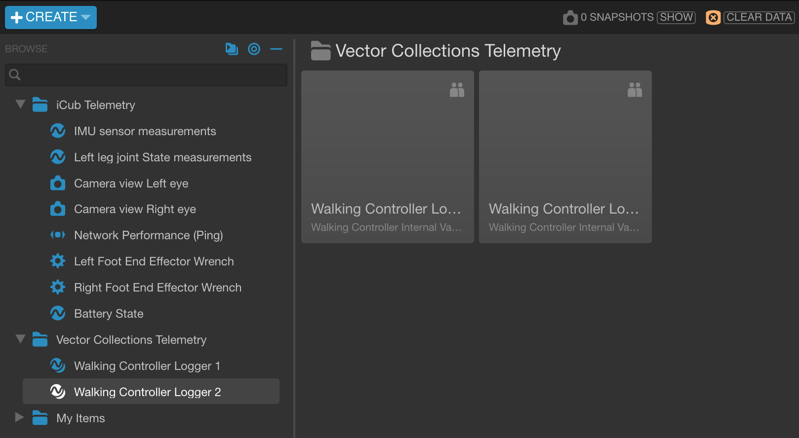

# Add a New Vector Collection Port and the Respective Domain Object in the Visualizer

You can add a new telemetry entry under the folder "Vector Collections Telemetry" in the viualizer workspace, which will read from a Yarp port publishing `BipedalLocomotion.YarpUtilities.VectorsCollection` type data. This can be done by adding
- the respective port configuration entry in the `portInConfig` section of the JSON configuration defined in `config/default.json`.
  ```json
  {
      ...,
      "portInConfig": {
          ...,
          "<telemetry-key>": {
              "yarpName": "<yarp-output-port-name-publishing-the-data-to-visualize>",
              "localName": "<arbitrary-port-name-collecting-the-data-for-the-telemetry-server>",
              "portType": "bottle",
              "parser": {
                  "type": "internal",
                  "outputFormat": "vectorCollection"
              }
          }
      }
  }
  ```
  | Parameter | Description | Allowed Values |
  | --- | --- | --- |
  | yarpName | The source port publishing the data to visualize. | String |
  | localName | The destination port to be connected to the source port, and from which the telemetry server shall read the data. | String |
  | portType | The source port type from Yarp perspective, typically "bottle" or "image". | "bottle"<sup>*</sup> |
  | parser.type | The parsing is either implemented within the `ICubTelemetry` class ("internal"), either relayed to a Yarp device ("yarpDevice"). | "internal"<sup>**</sup> |
  | parser.outputFormat | Conditional field applicable for the "internal" parser type. The port data format, as well as the parser output format (flattened JSON object) are derived either from the signal either from the dynamic vector collection format. | "vectorCollection"<sup>***</sup> |

  (\*) Ports publishing data of type `BipedalLocomotion.YarpUtilities.VectorsCollection` are always of type "bottle".

  (\*\*) Currently, the only supported parser `"type"` is `"internal"`. In the future, we could select parsers implemented by Yarp devices once these are ported through Yarp Javascript bindings.

  (\*\*\*) For now, only the telemetry entries whose data is read from `BipedalLocomotion.YarpUtilities.VectorsCollection` data type can be added through these configuration files, without requiring source code changes.

- the respective telemetry entry in the dictionary definition `openmctStaticServer/dictionaryVectorCollectionsTemplate.json`.
  ```json
  {
    "name": "<Telemetry Entry Name>",
    "key": "<same telemetry-key matching the key used in the portInConfig section>",
    "type": "yarpopenmct.veccollectionmap",
    "values": [
      {
        "key": "value.singalName.0",
        "name": "singalName[0]",
        "units": "SI units",
        "format": "float",
        "hints": {
          "range": 1
        }
      },
      {
        "key": "utc",
        "source": "timestamp",
        "name": "Timestamp",
        "format": "utc",
        "hints": {
          "domain": 1
        }
      }
    ]
  }
  ```


<p align='center'>

</p>
