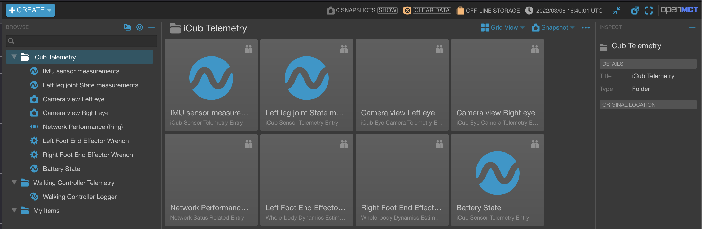

# Configure the Visualizer Client

We describe here the user interface for configuring the visualizer client, typically for:
- modifying the appearence of the telemetry entries under the telemetry folders in the left pane of the visualizer browser client,
- providing an abstraction for grouping and interpreting data.

<p align='center'>

</p>

## Edit Existing Domain Object Types (:warning: advanced users only)

The Domain Objects appearing on the far left pane of the visualizer (`IMU sensor measurements`, `Left leg joint state measurements`, etc) can have associated types which can provide an abstraction for grouping, visualizing and interpreting purposes. Further documentation can be found in [Open-MCT API and tutorial](https://github.com/nasa/openmct/blob/master/API.md#object-attributes:), but we recap here the essentials.

Such types are objects defined in [`../openmctStaticServer/plugins/conf/domainObjTypes.js`](../openmctStaticServer/plugins/conf/domainObjTypes.js).

The **type** object attributes are:
- A `string` key identifying the type, and used when specifying the Domain Object types in the dicionary `json` files. It is recommended prefixing your types with a namespace to avoid conflicts with other plugins (e.g. `yarpopenmct.sensormeas`, `yarpopenmct.camimage`, etc).
- The actual object type specification with the following attributes:
  - `name`: a string naming this object type;
  - `description`: a string specifying a longer-form description of this type;
  - `icon`: a string specifying a CSS class to apply to each representation of this object, i.e. used for specifying an icon to appear next to it. There are a number of built-in icon classes [available in Open MCT](https://github.com/nasa/openmct/blob/master/src/styles/_glyphs.scss).
  - `reportSchedule`: listing all the supported modes of telemetry scheduling.
    - **ReportSchedule.Historical:** Supports historical data request.
    - **ReportSchedule.Realtime:** Supports periodic telemetry data streaming (realtime) to subscribers. Every time the user clicks on a Domain Object on the left pane of the visualizer client page, a subscription request is sent to the telemetry server.
  - `telemetryMetadataDflt`: Telemetry metadata defaults. Refer to setions [Optional Parameters](./add-new-vector-collection-port.md#optional-parameters) and [Default Values for `conf/dictionaryVectorCollectionsTelemetry.json` Dictionary](./add-new-vector-collection-port.md#default-values-for-confdictionaryvectorcollectionstelemetryjson-dictionary) in the tutorial ["add new vector collection port"](./add-new-vector-collection-port.md) for further details.

Note: F.Y.I, this interface extends the OpenMCT type object interface defined in https://github.com/nasa/openmct/blob/master/API.md#domain-object-types.

The currently defined types are depicted below and can be edited by the user:
https://github.com/ami-iit/yarp-openmct/blob/4cf77100a4a5fc0d774606e1fd237bd586145dfb/openmctStaticServer/domainObjTypes.js#L1-L62

The final appearance of the respective Domain Objects are as follows:


## Map the Domain Object Types to the Telemetry Entries

The types defined above, represented by the respective keys, can be associated to a Domain object within the dictionary as follows:
```js
{
  "name": "iCub Telemetry",
  "key": "icubtelemetry",
  "telemetryEntries": [
    {
      "name": "IMU sensor measurements",
      "key": "sens.legacyIMU",
      "type": "yarpopenmct.sensormeas",
      "values": [...]
    },
    ...
  ]
}
```

Here we associate to the telemetry entry "IMU sensor measurements" the type `yarpopenmct.sensormeas` defined as:
https://github.com/ami-iit/yarp-openmct/blob/4cf77100a4a5fc0d774606e1fd237bd586145dfb/openmctStaticServer/domainObjTypes.js#L2-L11

The mapping can be freely modified by the user. We illustrate below a mapping example:

| Telemetry Entry | Domain Object Type |
| --- | --- |
| "sens.legacyIMU" | "yarpopenmct.sensormeas" |
| "sens.leftLegJointState" | "yarpopenmct.sensormeas" |
| "sens.camLeftEye" | "yarpopenmct.camimage" |
| "ping" | "yarpopenmct.nwstatus" |
| "sens.leftFootEEwrench" | "yarpopenmct.wbdestimation" |

Typically, in the case of camera images, as we don't have a proper plotting widget to display simultaneously images cumulated over a given range of time, historical data requests are not suited for streaming such telemetry data. The respective Domain Object type fields should have the field `reportSchedule` set to `[ReportSchedule.Realtime]`.
